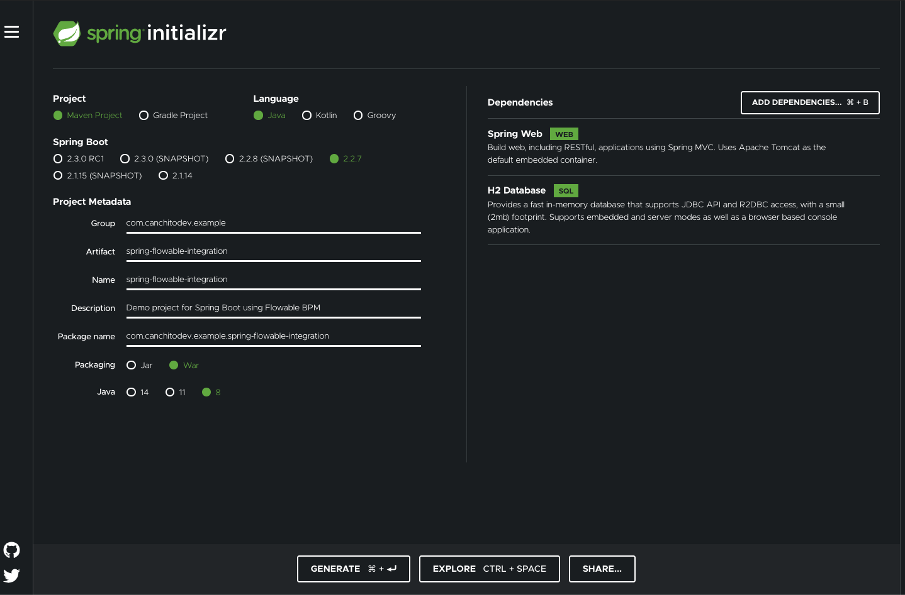
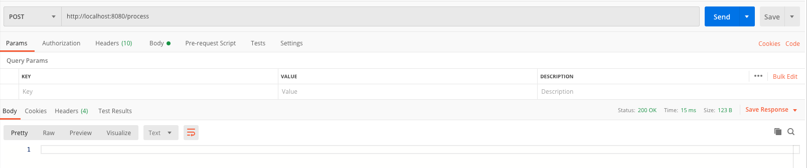
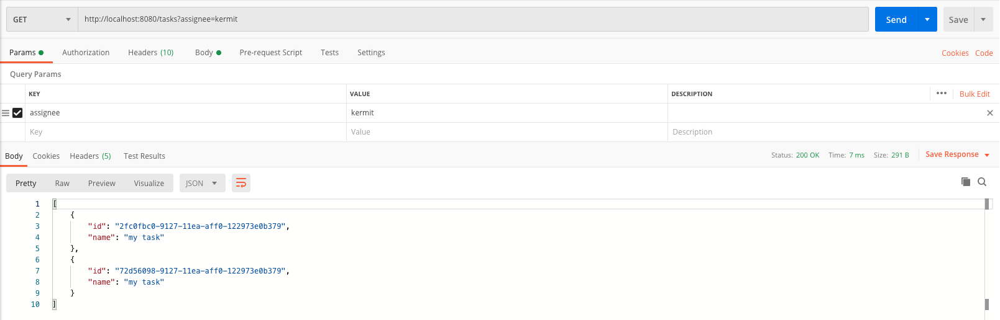
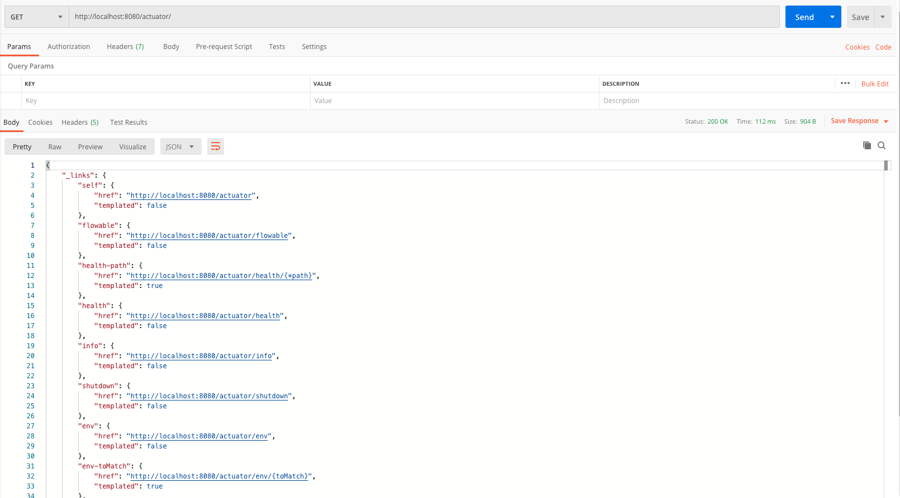
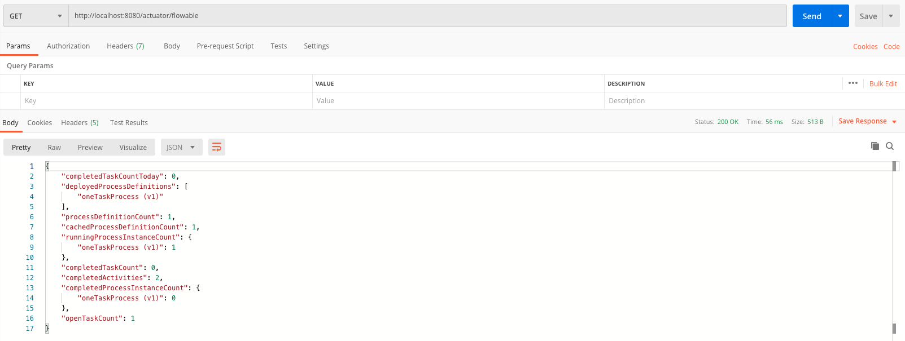
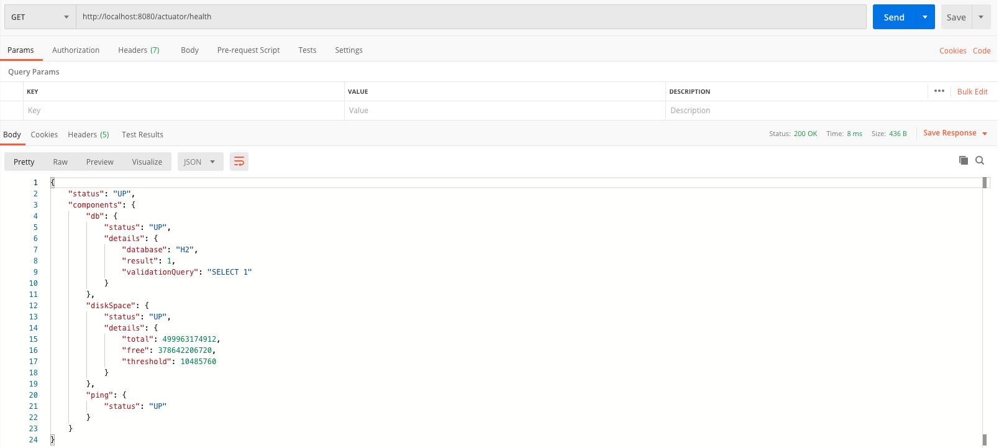
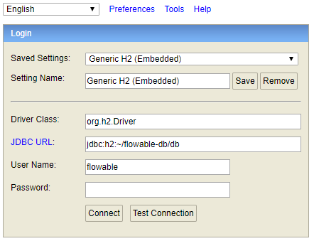
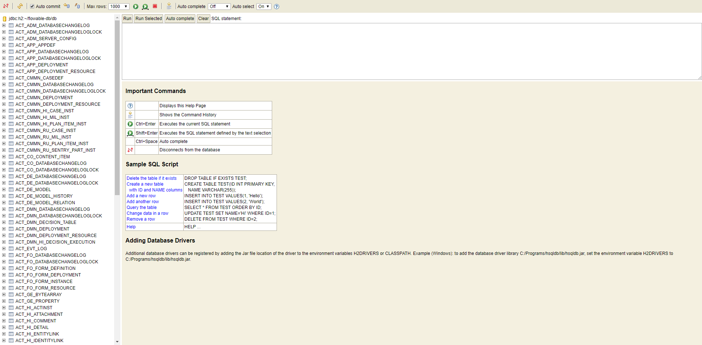

# spring-boot-flowable-bpm-integration

In this tutorial, we will be integrating Flowable's BPM engine into our Spring Boot application.

## License
The MIT License (MIT)  

Copyright (c) 2020, canchito-dev  

Permission is hereby granted, free of charge, to any person obtaining a copy of this software and associated documentation files (the “Software”), to deal in the Software without restriction, including without limitation the rights to use, copy, modify, merge, publish, distribute, sublicense, and/or sell copies of the Software, and to permit persons to whom the Software is furnished to do so, subject to the following conditions:  

The above copyright notice and this permission notice shall be included in all copies or substantial portions of the Software.  

THE SOFTWARE IS PROVIDED “AS IS”, WITHOUT WARRANTY OF ANY KIND, EXPRESS OR IMPLIED, INCLUDING BUT NOT LIMITED TO THE WARRANTIES OF MERCHANTABILITY, FITNESS FOR A PARTICULAR PURPOSE AND NONINFRINGEMENT. IN NO EVENT SHALL THE AUTHORS OR COPYRIGHT HOLDERS BE LIABLE FOR ANY CLAIM, DAMAGES OR OTHER LIABILITY, WHETHER IN AN ACTION OF CONTRACT, TORT OR OTHERWISE, ARISING FROM, OUT OF OR IN CONNECTION WITH THE SOFTWARE OR THE USE OR OTHER DEALINGS IN THE SOFTWARE.

## Contribute Code
If you would like to become an active contributor to this project please follow these simple steps:

1.  Fork it
2.  Create your feature branch
3.  Commit your changes
4.  Push to the branch
5.  Create new Pull Request

## What you’ll need
*   About 40 minutes
*   A favorite IDE. In this post, we use [Intellij Community](https://www.jetbrains.com/idea/download/index.html)
*   [JDK 7](http://www.oracle.com/technetwork/java/javase/downloads/index.html) or later. It can be made to work with JDK6, but it will need configuration tweaks. Please check the Spring Boot documentation

## Compatibility

Flowable supports both Spring Boot 2.0 and 1.5 with the same starters. The base support is for Spring Boot 2.0, which means that the actuator endpoints are only supported on 2.0. The Flowable starters are also puling spring boot starter transitively, which means that users will have to define the 1.5 version of the spring boot starters in their own build files.

## Starting with Spring Initializr

For all Spring applications, it is always a good idea to start with the [Spring Initializr](https://start.spring.io/). The Initializr is an excellent option for pulling in all the dependencies you need for an application and does a lot of the setup for you. This example needs only the Spring Web, and H2 Database dependency. The following image shows the Initializr set up for this sample project:



The following listing shows the `pom.xml` file that is created when you choose Maven:

```xml
<?xml version="1.0" encoding="UTF-8"?>  
<project xmlns="http://maven.apache.org/POM/4.0.0" xmlns:xsi="http://www.w3.org/2001/XMLSchema-instance" xsi:schemaLocation="http://maven.apache.org/POM/4.0.0 https://maven.apache.org/xsd/maven-4.0.0.xsd">
	<modelVersion>4.0.0</modelVersion>  
	<parent> <groupId>org.springframework.boot</groupId>  
		<artifactId>spring-boot-starter-parent</artifactId>  
		<version>2.2.7.RELEASE</version>  
		<relativePath/> <!-- lookup parent from repository -->  
	</parent>  
	<groupId>com.canchitodev.example</groupId>  
	<artifactId>spring-flowable-integration</artifactId>  
	<version>0.0.1-SNAPSHOT</version>  
	<packaging>war</packaging>  
  
	<name>spring-flowable-integration</name>  
	<description>Demo project for Spring Boot using Flowable BPM</description>  
  
	<organization> <name>Canchito Development</name>  
		<url>http://www.canchito-dev.com</url>  
	</organization>  
	<issueManagement> <system>Canchito Development</system>  
		<url>https://github.com/canchito-dev/spring-flowable-integration/issues</url>  
	</issueManagement>  
	<url>https://github.com/canchito-dev/spring-flowable-integration</url>
	
	<properties>
		<project.build.sourceEncoding>UTF-8</project.build.sourceEncoding>  
		<project.reporting.outputEncoding>UTF-8</project.reporting.outputEncoding>  
		<java.version>1.8</java.version>  
		<flowable.version>6.5.0</flowable.version>  
	</properties>  
 
	<dependencies>
		<!-- Starter for building web, including RESTful, applications using Spring MVC. Uses Tomcat as the default embedded container -->  
		<dependency>
			<groupId>org.springframework.boot</groupId>
			<artifactId>spring-boot-starter-web</artifactId>
		</dependency>
		<!-- Starter for building web, including RESTful, applications using Spring MVC. Uses Tomcat as the default embedded container -->  
		
		<!-- H2 Database Engine -->
		<dependency>
			<groupId>com.h2database</groupId>
			<artifactId>h2</artifactId>
			<scope>runtime</scope>
		</dependency>
		<!-- H2 Database Engine -->
		
		<!-- Starter for using Tomcat as the embedded servlet container. Default servlet container starter used by spring-boot-starter-web -->
		<dependency>  
			<groupId>org.springframework.boot</groupId>  
			<artifactId>spring-boot-starter-tomcat</artifactId>  
		</dependency>  
		<!-- Starter for using Tomcat as the embedded servlet container. Default servlet container starter used by spring-boot-starter-web -->  

		<!-- Starter for testing Spring Boot applications with libraries including JUnit, Hamcrest and Mockito -->  
		<dependency>  
			<groupId>org.springframework.boot</groupId>  
			<artifactId>spring-boot-starter-test</artifactId>  
			<scope>test</scope>  
			<exclusions> 
				<exclusion> 
					<groupId>org.junit.vintage</groupId>  
					<artifactId>junit-vintage-engine</artifactId>  
				</exclusion> 
			</exclusions> 
		</dependency>  
		<!-- Starter for testing Spring Boot applications with libraries including JUnit, Hamcrest and Mockito -->  
	</dependencies>  

	<build> 
		<plugins> 
			<plugin> 
				<groupId>org.springframework.boot</groupId>  
				<artifactId>spring-boot-maven-plugin</artifactId>  
			</plugin> 
		</plugins> 
	</build>  
</project>
```

## Adding Flowable's Dependencies

Now, simply add _flowable-spring-boot-starter_ dependency. This will add all the engines.

```xml
<!-- Flowable Spring Boot Starter Basic -->
<dependency>
	<groupId>org.flowable</groupId>
	<artifactId>flowable-spring-boot-starter-basic</artifactId>
	<version>${flowable.version}</version>
</dependency>
<!-- Flowable Spring Boot Starter Basic -->
```
That’s all that’s needed. This dependency will transitively add the correct Flowable dependencies to the classpath. You can now run your Spring Boot application. But before you do, create the following folders under _src/main/resources_:

```
src
  |- main
     |- resources
        |- **processes**
        |- **cases**
        |- **dmn**
        |- **forms**
```

And inside the folder _src/main/resources/processes_, create a file named _one-task-process.bpmn20.xml_. This is a dummy process definition. The content of the file is below:

```xml
<?xml version="1.0" encoding="UTF-8"?>
<definitions xmlns="http://www.omg.org/spec/BPMN/20100524/MODEL" xmlns:flowable="http://flowable.org/bpmn" targetNamespace="Examples">
	<process id="oneTaskProcess" name="The One Task Process"> 
		<startEvent id="theStart" /> 
		<sequenceFlow id="flow1" sourceRef="theStart" targetRef="theTask" /> 
		<userTask id="theTask" name="my task" flowable:assignee="kermit" /> 
		<sequenceFlow id="flow2" sourceRef="theTask" targetRef="theEnd" /> 
		<endEvent id="theEnd" /> 
	</process> 
</definitions>
```

Ok, now you can run you application:

```java
@SpringBootApplication  
public class SpringFlowableIntegrationApplication {  
   public static void main(String[] args) {  
      SpringApplication.run(SpringFlowableIntegrationApplication.class, args);  
  }   
}
```

You will see an output like this:

```
  .   ____          _            __ _ _
 /\\ / ___'_ __ _ _(_)_ __  __ _ \ \ \ \
( ( )\___ | '_ | '_| | '_ \/ _` | \ \ \ \
 \\/  ___)| |_)| | | | | || (_| |  ) ) ) )
  '  |____| .__|_| |_|_| |_\__, | / / / /
 =========|_|==============|___/=/_/_/_/
 :: Spring Boot ::        (v2.2.7.RELEASE)

2020-05-08 13:37:02.325  INFO 9935 --- [           main] e.s.SpringFlowableIntegrationApplication : Starting SpringFlowableIntegrationApplication on MacBook-Pro.local with PID 9935 (/Users/canchitodev/development/spring-flowable-integration/target/classes started by jose.carlos.mendoza.prego in /Users/jose.carlos.mendoza.prego/Downloads/spring-flowable-integration)
2020-05-08 13:37:02.327  INFO 9935 --- [           main] e.s.SpringFlowableIntegrationApplication : No active profile set, falling back to default profiles: default
2020-05-08 13:37:02.993  INFO 9935 --- [           main] o.s.b.w.embedded.tomcat.TomcatWebServer  : Tomcat initialized with port(s): 8080 (http)
2020-05-08 13:37:02.999  INFO 9935 --- [           main] o.apache.catalina.core.StandardService   : Starting service [Tomcat]
2020-05-08 13:37:03.000  INFO 9935 --- [           main] org.apache.catalina.core.StandardEngine  : Starting Servlet engine: [Apache Tomcat/9.0.34]
2020-05-08 13:37:03.133  INFO 9935 --- [           main] o.a.c.c.C.[Tomcat].[localhost].[/]       : Initializing Spring embedded WebApplicationContext
2020-05-08 13:37:03.133  INFO 9935 --- [           main] o.s.web.context.ContextLoader            : Root WebApplicationContext: initialization completed in 778 ms
2020-05-08 13:37:03.264  INFO 9935 --- [           main] o.s.s.concurrent.ThreadPoolTaskExecutor  : Initializing ExecutorService 'applicationTaskExecutor'
2020-05-08 13:37:03.479  INFO 9935 --- [           main] o.f.s.b.e.EventRegistryAutoConfiguration : No deployment resources were found for autodeployment
2020-05-08 13:37:03.500  INFO 9935 --- [           main] o.f.s.SpringProcessEngineConfiguration   : Found 2 Engine Configurators in total:
2020-05-08 13:37:03.501  INFO 9935 --- [           main] o.f.s.SpringProcessEngineConfiguration   : class org.flowable.eventregistry.spring.configurator.SpringEventRegistryConfigurator (priority:100000)
2020-05-08 13:37:03.501  INFO 9935 --- [           main] o.f.s.SpringProcessEngineConfiguration   : class org.flowable.idm.engine.configurator.IdmEngineConfigurator (priority:150000)
2020-05-08 13:37:03.501  INFO 9935 --- [           main] o.f.s.SpringProcessEngineConfiguration   : Executing beforeInit() of class org.flowable.eventregistry.spring.configurator.SpringEventRegistryConfigurator (priority:100000)
2020-05-08 13:37:03.529  INFO 9935 --- [           main] o.f.s.SpringProcessEngineConfiguration   : Executing beforeInit() of class org.flowable.idm.engine.configurator.IdmEngineConfigurator (priority:150000)
2020-05-08 13:37:03.555  INFO 9935 --- [           main] com.zaxxer.hikari.HikariDataSource       : HikariPool-1 - Starting...
2020-05-08 13:37:03.646  INFO 9935 --- [           main] com.zaxxer.hikari.HikariDataSource       : HikariPool-1 - Start completed.
2020-05-08 13:37:04.353  INFO 9935 --- [           main] o.f.s.SpringProcessEngineConfiguration   : Executing configure() of class org.flowable.eventregistry.spring.configurator.SpringEventRegistryConfigurator (priority:100000)
2020-05-08 13:37:04.384  INFO 9935 --- [           main] o.f.c.e.impl.db.CommonDbSchemaManager    : performing create on common with resource org/flowable/common/db/create/flowable.h2.create.common.sql
2020-05-08 13:37:04.917  INFO 9935 --- [           main] liquibase.executor.jvm.JdbcExecutor      : SELECT COUNT(*) FROM PUBLIC.FLW_EV_DATABASECHANGELOGLOCK
2020-05-08 13:37:04.924  INFO 9935 --- [           main] liquibase.executor.jvm.JdbcExecutor      : CREATE TABLE PUBLIC.FLW_EV_DATABASECHANGELOGLOCK (ID INT NOT NULL, LOCKED BOOLEAN NOT NULL, LOCKGRANTED TIMESTAMP, LOCKEDBY VARCHAR(255), CONSTRAINT PK_FLW_EV_DATABASECHANGELOGLOCK PRIMARY KEY (ID))
2020-05-08 13:37:04.925  INFO 9935 --- [           main] liquibase.executor.jvm.JdbcExecutor      : SELECT COUNT(*) FROM PUBLIC.FLW_EV_DATABASECHANGELOGLOCK
2020-05-08 13:37:04.928  INFO 9935 --- [           main] liquibase.executor.jvm.JdbcExecutor      : DELETE FROM PUBLIC.FLW_EV_DATABASECHANGELOGLOCK
2020-05-08 13:37:04.929  INFO 9935 --- [           main] liquibase.executor.jvm.JdbcExecutor      : INSERT INTO PUBLIC.FLW_EV_DATABASECHANGELOGLOCK (ID, LOCKED) VALUES (1, FALSE)
2020-05-08 13:37:04.930  INFO 9935 --- [           main] liquibase.executor.jvm.JdbcExecutor      : SELECT LOCKED FROM PUBLIC.FLW_EV_DATABASECHANGELOGLOCK WHERE ID=1
2020-05-08 13:37:04.936  INFO 9935 --- [           main] l.lockservice.StandardLockService        : Successfully acquired change log lock
2020-05-08 13:37:06.280  INFO 9935 --- [           main] l.c.StandardChangeLogHistoryService      : Creating database history table with name: PUBLIC.FLW_EV_DATABASECHANGELOG
2020-05-08 13:37:06.281  INFO 9935 --- [           main] liquibase.executor.jvm.JdbcExecutor      : CREATE TABLE PUBLIC.FLW_EV_DATABASECHANGELOG (ID VARCHAR(255) NOT NULL, AUTHOR VARCHAR(255) NOT NULL, FILENAME VARCHAR(255) NOT NULL, DATEEXECUTED TIMESTAMP NOT NULL, ORDEREXECUTED INT NOT NULL, EXECTYPE VARCHAR(10) NOT NULL, MD5SUM VARCHAR(35), DESCRIPTION VARCHAR(255), COMMENTS VARCHAR(255), TAG VARCHAR(255), LIQUIBASE VARCHAR(20), CONTEXTS VARCHAR(255), LABELS VARCHAR(255), DEPLOYMENT_ID VARCHAR(10))
2020-05-08 13:37:06.281  INFO 9935 --- [           main] liquibase.executor.jvm.JdbcExecutor      : SELECT COUNT(*) FROM PUBLIC.FLW_EV_DATABASECHANGELOG
2020-05-08 13:37:06.282  INFO 9935 --- [           main] l.c.StandardChangeLogHistoryService      : Reading from PUBLIC.FLW_EV_DATABASECHANGELOG
2020-05-08 13:37:06.282  INFO 9935 --- [           main] liquibase.executor.jvm.JdbcExecutor      : SELECT * FROM PUBLIC.FLW_EV_DATABASECHANGELOG ORDER BY DATEEXECUTED ASC, ORDEREXECUTED ASC
2020-05-08 13:37:06.283  INFO 9935 --- [           main] liquibase.executor.jvm.JdbcExecutor      : SELECT COUNT(*) FROM PUBLIC.FLW_EV_DATABASECHANGELOGLOCK
2020-05-08 13:37:06.305  INFO 9935 --- [           main] liquibase.executor.jvm.JdbcExecutor      : CREATE TABLE PUBLIC.FLW_EVENT_DEPLOYMENT (ID_ VARCHAR(255) NOT NULL, NAME_ VARCHAR(255), CATEGORY_ VARCHAR(255), DEPLOY_TIME_ TIMESTAMP, TENANT_ID_ VARCHAR(255), PARENT_DEPLOYMENT_ID_ VARCHAR(255), CONSTRAINT PK_FLW_EVENT_DEPLOYMENT PRIMARY KEY (ID_))
2020-05-08 13:37:06.306  INFO 9935 --- [           main] liquibase.changelog.ChangeSet            : Table FLW_EVENT_DEPLOYMENT created
2020-05-08 13:37:06.306  INFO 9935 --- [           main] liquibase.executor.jvm.JdbcExecutor      : CREATE TABLE PUBLIC.FLW_EVENT_RESOURCE (ID_ VARCHAR(255) NOT NULL, NAME_ VARCHAR(255), DEPLOYMENT_ID_ VARCHAR(255), RESOURCE_BYTES_ BLOB, CONSTRAINT PK_FLW_EVENT_RESOURCE PRIMARY KEY (ID_))
2020-05-08 13:37:06.307  INFO 9935 --- [           main] liquibase.changelog.ChangeSet            : Table FLW_EVENT_RESOURCE created
2020-05-08 13:37:06.307  INFO 9935 --- [           main] liquibase.executor.jvm.JdbcExecutor      : CREATE TABLE PUBLIC.FLW_EVENT_DEFINITION (ID_ VARCHAR(255) NOT NULL, NAME_ VARCHAR(255), VERSION_ INT, KEY_ VARCHAR(255), CATEGORY_ VARCHAR(255), DEPLOYMENT_ID_ VARCHAR(255), TENANT_ID_ VARCHAR(255), RESOURCE_NAME_ VARCHAR(255), DESCRIPTION_ VARCHAR(255), CONSTRAINT PK_FLW_EVENT_DEFINITION PRIMARY KEY (ID_))
2020-05-08 13:37:06.308  INFO 9935 --- [           main] liquibase.changelog.ChangeSet            : Table FLW_EVENT_DEFINITION created
2020-05-08 13:37:06.308  INFO 9935 --- [           main] liquibase.executor.jvm.JdbcExecutor      : CREATE UNIQUE INDEX PUBLIC.ACT_IDX_EVENT_DEF_UNIQ ON PUBLIC.FLW_EVENT_DEFINITION(KEY_, VERSION_, TENANT_ID_)
2020-05-08 13:37:06.309  INFO 9935 --- [           main] liquibase.changelog.ChangeSet            : Index ACT_IDX_EVENT_DEF_UNIQ created
2020-05-08 13:37:06.310  INFO 9935 --- [           main] liquibase.executor.jvm.JdbcExecutor      : CREATE TABLE PUBLIC.FLW_CHANNEL_DEFINITION (ID_ VARCHAR(255) NOT NULL, NAME_ VARCHAR(255), VERSION_ INT, KEY_ VARCHAR(255), CATEGORY_ VARCHAR(255), DEPLOYMENT_ID_ VARCHAR(255), CREATE_TIME_ TIMESTAMP, TENANT_ID_ VARCHAR(255), RESOURCE_NAME_ VARCHAR(255), DESCRIPTION_ VARCHAR(255), CONSTRAINT PK_FLW_CHANNEL_DEFINITION PRIMARY KEY (ID_))
2020-05-08 13:37:06.310  INFO 9935 --- [           main] liquibase.changelog.ChangeSet            : Table FLW_CHANNEL_DEFINITION created
2020-05-08 13:37:06.310  INFO 9935 --- [           main] liquibase.executor.jvm.JdbcExecutor      : CREATE UNIQUE INDEX PUBLIC.ACT_IDX_CHANNEL_DEF_UNIQ ON PUBLIC.FLW_CHANNEL_DEFINITION(KEY_, VERSION_, TENANT_ID_)
2020-05-08 13:37:06.311  INFO 9935 --- [           main] liquibase.changelog.ChangeSet            : Index ACT_IDX_CHANNEL_DEF_UNIQ created
2020-05-08 13:37:06.311  INFO 9935 --- [           main] liquibase.changelog.ChangeSet            : ChangeSet org/flowable/eventregistry/db/liquibase/flowable-eventregistry-db-changelog.xml::1::flowable ran successfully in 7ms
2020-05-08 13:37:06.312  INFO 9935 --- [           main] liquibase.executor.jvm.JdbcExecutor      : SELECT MAX(ORDEREXECUTED) FROM PUBLIC.FLW_EV_DATABASECHANGELOG
2020-05-08 13:37:06.315  INFO 9935 --- [           main] liquibase.executor.jvm.JdbcExecutor      : INSERT INTO PUBLIC.FLW_EV_DATABASECHANGELOG (ID, AUTHOR, FILENAME, DATEEXECUTED, ORDEREXECUTED, MD5SUM, DESCRIPTION, COMMENTS, EXECTYPE, CONTEXTS, LABELS, LIQUIBASE, DEPLOYMENT_ID) VALUES ('1', 'flowable', 'org/flowable/eventregistry/db/liquibase/flowable-eventregistry-db-changelog.xml', NOW(), 1, '8:1b0c48c9cf7945be799d868a2626d687', 'createTable tableName=FLW_EVENT_DEPLOYMENT; createTable tableName=FLW_EVENT_RESOURCE; createTable tableName=FLW_EVENT_DEFINITION; createIndex indexName=ACT_IDX_EVENT_DEF_UNIQ, tableName=FLW_EVENT_DEFINITION; createTable tableName=FLW_CHANNEL_DEFIN...', '', 'EXECUTED', NULL, NULL, '3.8.9', '8937826283')
2020-05-08 13:37:06.325  INFO 9935 --- [           main] l.lockservice.StandardLockService        : Successfully released change log lock
2020-05-08 13:37:06.325  INFO 9935 --- [           main] o.f.e.impl.EventRegistryEngineImpl       : EventRegistryEngine default created
2020-05-08 13:37:06.326  INFO 9935 --- [           main] o.f.s.SpringProcessEngineConfiguration   : Executing configure() of class org.flowable.idm.engine.configurator.IdmEngineConfigurator (priority:150000)
2020-05-08 13:37:06.340  INFO 9935 --- [           main] o.f.i.engine.impl.db.IdmDbSchemaManager  : performing create on identity with resource org/flowable/idm/db/create/flowable.h2.create.identity.sql
2020-05-08 13:37:06.353  INFO 9935 --- [           main] o.f.idm.engine.impl.IdmEngineImpl        : IdmEngine default created
2020-05-08 13:37:06.362  INFO 9935 --- [           main] o.f.i.s.i.d.IdentityLinkDbSchemaManager  : performing create on identitylink with resource org/flowable/identitylink/service/db/create/flowable.h2.create.identitylink.sql
2020-05-08 13:37:06.365  INFO 9935 --- [           main] o.f.i.s.i.d.IdentityLinkDbSchemaManager  : performing create on identitylink.history with resource org/flowable/identitylink/service/db/create/flowable.h2.create.identitylink.history.sql
2020-05-08 13:37:06.368  INFO 9935 --- [           main] o.f.e.s.i.db.EntityLinkDbSchemaManager   : performing create on entitylink with resource org/flowable/entitylink/service/db/create/flowable.h2.create.entitylink.sql
2020-05-08 13:37:06.370  INFO 9935 --- [           main] o.f.e.s.i.db.EntityLinkDbSchemaManager   : performing create on entitylink.history with resource org/flowable/entitylink/service/db/create/flowable.h2.create.entitylink.history.sql
2020-05-08 13:37:06.372  INFO 9935 --- [           main] e.s.i.d.EventSubscriptionDbSchemaManager : performing create on eventsubscription with resource org/flowable/eventsubscription/service/db/create/flowable.h2.create.eventsubscription.sql
2020-05-08 13:37:06.374  INFO 9935 --- [           main] o.f.t.s.impl.db.TaskDbSchemaManager      : performing create on task with resource org/flowable/task/service/db/create/flowable.h2.create.task.sql
2020-05-08 13:37:06.376  INFO 9935 --- [           main] o.f.t.s.impl.db.TaskDbSchemaManager      : performing create on task.history with resource org/flowable/task/service/db/create/flowable.h2.create.task.history.sql
2020-05-08 13:37:06.383  INFO 9935 --- [           main] o.f.v.s.impl.db.VariableDbSchemaManager  : performing create on variable with resource org/flowable/variable/service/db/create/flowable.h2.create.variable.sql
2020-05-08 13:37:06.386  INFO 9935 --- [           main] o.f.v.s.impl.db.VariableDbSchemaManager  : performing create on variable.history with resource org/flowable/variable/service/db/create/flowable.h2.create.variable.history.sql
2020-05-08 13:37:06.388  INFO 9935 --- [           main] o.f.j.s.impl.db.JobDbSchemaManager       : performing create on job with resource org/flowable/job/service/db/create/flowable.h2.create.job.sql
2020-05-08 13:37:06.408  INFO 9935 --- [           main] o.f.b.s.impl.db.BatchDbSchemaManager     : performing create on batch with resource org/flowable/batch/service/db/create/flowable.h2.create.batch.sql
2020-05-08 13:37:06.410  INFO 9935 --- [           main] o.f.e.impl.db.ProcessDbSchemaManager     : performing create on engine with resource org/flowable/db/create/flowable.h2.create.engine.sql
2020-05-08 13:37:06.440  INFO 9935 --- [           main] o.f.e.impl.db.ProcessDbSchemaManager     : performing create on history with resource org/flowable/db/create/flowable.h2.create.history.sql
2020-05-08 13:37:06.467  INFO 9935 --- [           main] o.f.engine.impl.ProcessEngineImpl        : ProcessEngine default created
2020-05-08 13:37:06.493  INFO 9935 --- [           main] o.f.e.impl.cmd.ValidateV5EntitiesCmd     : Total of v5 deployments found: 0
2020-05-08 13:37:06.606  INFO 9935 --- [           main] o.s.s.c.ThreadPoolTaskScheduler          : Initializing ExecutorService
2020-05-08 13:37:06.608  INFO 9935 --- [           main] o.f.j.s.i.a.AbstractAsyncExecutor        : Starting up the async job executor [org.flowable.spring.job.service.SpringAsyncExecutor].
2020-05-08 13:37:06.608  INFO 9935 --- [       Thread-1] o.f.j.s.i.a.AcquireAsyncJobsDueRunnable  : starting to acquire async jobs due
2020-05-08 13:37:06.609  INFO 9935 --- [       Thread-2] o.f.j.s.i.a.AcquireTimerJobsRunnable     : starting to acquire async jobs due
2020-05-08 13:37:06.609  INFO 9935 --- [       Thread-3] o.f.j.s.i.a.ResetExpiredJobsRunnable     : starting to reset expired jobs for engine bpmn
2020-05-08 13:37:06.730  INFO 9935 --- [           main] o.s.b.w.embedded.tomcat.TomcatWebServer  : Tomcat started on port(s): 8080 (http) with context path ''
2020-05-08 13:37:06.735  INFO 9935 --- [           main] e.s.SpringFlowableIntegrationApplication : Started SpringFlowableIntegrationApplication in 4.674 seconds (JVM running for 10.405)
```

With just a few changes, a lot has happened:

 - Because we hare using H2 driver, an in-memory database was automatically created and passed to the Flowable process engine configuration
 - A Flowable ProcessEngine, CmmnEngine, DmnEngine, FormEngine, ContentEngine and IdmEngine beans have been created and exposed
 - All the Flowable services are exposed as Spring beans
 - The Spring Job Executor is created

In addition, any BPMN 2.0 process definition, CMMN 1.1 case definitions, DMN 1.1 dmn definitions, and Form definitions found under the previously created resource folders, will be automatically deployed. In our case,  the previously created BPMN 2.0 process definition _one-task-process.bpmn20.xml_ was deployed.

In order to make sure that everything is correct, and that the deployment actually worked, add the following lines of code:

```java
@SpringBootApplication  
public class SpringFlowableIntegrationApplication {  
	public static void main(String[] args) {  
	    SpringApplication.run(SpringFlowableIntegrationApplication.class, args);  
	}
	
	@Bean  
	public CommandLineRunner init(final RepositoryService repositoryService, 
									final RuntimeService runtimeService,  
									final TaskService taskService) {
		return new CommandLineRunner() {  
	        @Override  
			public void run(String... strings) throws Exception {  
	            System.out.println("Number of process definitions : "  
					+ repositoryService.createProcessDefinitionQuery().count());  
				System.out.println("Number of tasks : " + taskService.createTaskQuery().count());  
				
				runtimeService.startProcessInstanceByKey("oneTaskProcess");  
				
				System.out.println("Number of tasks after process start: "  
					+ taskService.createTaskQuery().count());  
			}
		};
	}  
}
```

If everything went well, you should see the following:

```
Number of process definitions : 1
Number of tasks : 0
Number of tasks after process start: 1
```

## Add REST Support
It is very common to use a REST API on top of the embedded Flowable engine, because it allows your application to interact with other micro services. Spring Boot makes this really easy. Add following dependency to the classpath:

```xml
<!-- Flowable Spring Boot Starter Rest Api -->  
<dependency>  
	<groupId>org.flowable</groupId>  
	<artifactId>flowable-spring-boot-starter-rest</artifactId>  
	<version>${flowable.version}</version>  
</dependency>  
<!-- Flowable Spring Boot Starter Rest Api -->
```
Now, let's create two custom endpoints. One for starting process instances of our previously created BPMN 2.0 process definition, and one for getting the active user tasks.

Create a new class, a Spring service called _MyService_ and create two methods which wrap Flowable calls, but in real-life scenarios this will be more complex.

```java
@Service  
public class MyService {
	@Autowired  
	private RuntimeService runtimeService;  
  
	@Autowired  
	private TaskService taskService;  
  
	@Transactional  
	public void startProcess() {  
	    runtimeService.startProcessInstanceByKey("oneTaskProcess");  
	}  
  
    @Transactional  
	public List<Task> getTasks(String assignee) {  
	    return taskService.createTaskQuery().taskAssignee(assignee).list();  
	}  
}
```
We can now create a REST endpoint by annotating a class with _@RestController_. Here, we simply delegate to the service defined above.

```java
@RestController  
public class MyRestController {  
	@Autowired  
	private MyService myService;  
  
	@PostMapping(value="/process")  
    public void startProcessInstance() {  
	    myService.startProcess();  
	}  
  
    @RequestMapping(value="/tasks", method= RequestMethod.GET, produces= MediaType.APPLICATION_JSON_VALUE)  
    public List<TaskRepresentation> getTasks(@RequestParam String assignee) {  
	    List<Task> tasks = myService.getTasks(assignee);  
		List<TaskRepresentation> dtos = new ArrayList<TaskRepresentation>();  
		for (Task task : tasks)
	        dtos.add(new TaskRepresentation(task.getId(), task.getName()));
        return dtos;  
	}  
  
    static class TaskRepresentation {
	    private String id;  
		private String name;  
  
		 public TaskRepresentation(String id, String name) {  
	         this.id = id;  
			 this.name = name;  
		 }  
  
	     public String getId() { return id; }  
	     
	     public void setId(String id) { this.id = id; }  
        
	     public String getName() { return name; }  
        
	     public void setName(String name) { this.name = name; }
    }  
}
```

Both the _@Service_ and the _@RestController_ will be found by the automatic component scan for a Spring Boot application. Run the application class again. We can now interact with the REST API, for example, by using cURL or Postman. First we start a process instance:


And now, we list the active user tasks for the user _kermit_. Note that if you did not comment the _CommandLineRunner_ bean, you will have two instances of the process running, and thus, two active user tasks:


## Actuator Endpoints
Flowable provides a Spring Boot Actuator Endpoint that exposes information for the Processes that are running. By default, all of Actuator's endpoints are mapped to `/actuator`, and Flowable's endpoint is not the exception, as it is mapped to  `/actuator/flowable`. Spring Boot by default only exposes the  `info`  and  `health`  endpoints. In order to enable the  `flowable`  endpoint you need to add  `management.endpoint.flowable.enabled=true`  to your  `application.properties`.

If you would like to know a bit more about Spring Boot production ready features, have a look at our post [Spring Boot Actuator – Production-ready features](http://www.canchito-dev.com/public/blog/2018/06/11/spring-boot-actuator-production-ready-features/).

In order to make enable Actuator endpoints you need to add a dependency on Actuator. We will take this chance, and also add Spring Boot Actuator's dependency:

```xml
<!-- Flowable Spring Boot Starter Actuator -->  
<dependency>  
	<groupId>org.flowable</groupId>  
	<artifactId>flowable-spring-boot-starter-actuator</artifactId>  
	<version>${flowable.version}</version>  
</dependency>  
<!-- Flowable Spring Boot Starter Actuator -->  
  
<!-- Starter for using Spring Boot's Actuator which provides production ready features to help you monitor and manage your application -->  
<dependency>  
	<groupId>org.springframework.boot</groupId>  
	<artifactId>spring-boot-starter-actuator</artifactId>  
</dependency>  
<!-- Starter for using Spring Boot's Actuator which provides production ready features to help you monitor and manage your application -->
```

Now, open your `application.properties`, and add the following lines:

```
management.endpoint.flowable.enabled=true
management.endpoints.enabled-by-default=true
management.endpoints.web.exposure.include=health,shutdown,env,info,flowable,mappings
management.endpoint.health.show-details=always
```

This will do the following:

 - Enable Flowable's actuator endpoint.
 - Enable Spring Boot's production ready endpoints.
 - Expose some specific endpoints.
 - By default, the `/health` endpoint, only tells you that the app is up, but we want to it to show a bit more of information.

Let's test the endpoint using Postman. First the `actuator` endpoint, which lists all the available endpoints.



Now, let's test Flowable's endpoint `actuator/flowable`



And finally, the `actuator/health` endpoint:



## Enable H2 Database Web Console
Until this moment, we have been using an in-memory H2 database. Lucky us, it has a web console that we can easily access. As you, by design, the in-memory database is volatile and data will be lost when we restart the application.

In order to enable H2 Console, add the following properties into your `application.properties` file:

```
spring.h2.console.enabled=true  
spring.h2.console.path=/h2-console  
spring.h2.console.settings.trace=true
```

By default, Spring Boot configures the application to **connect to an in-memory store with the username  _sa_  and an empty password**. However, we can change those parameters by adding the following properties to the `application.properties` file:

```
spring.datasource.username=flowable  
spring.datasource.password=flowable  
spring.datasource.url=jdbc:h2:~/flowable-db/db  
spring.datasource.driver-class-name=org.h2.Driver
```

Now restart your application and go to http://localhost:8080/h2-console. You should see some the log in page.



Once you log in, you will be able to explore the database and execute queries.



## Changing the database
To change the datasource, simply add the database driver dependencies and provide the URL to the database. For example, to switch to a MySQL database:

```
spring.datasource.username=flowable  
spring.datasource.password=flowable  
spring.datasource.driver-class-name=com.mysql.cj.jdbc.Driver
spring.datasource.url=jdbc:mysql://mysql-db:3306/flowable?characterEncoding=UTF-8
```

Remove H2 from the Maven dependencies and add the MySQL driver to the classpath:

```xml  
<!-- Databases  MySQL JDBC Type 4 drive -->  
<dependency>
	<groupId>mysql</groupId>  
	<artifactId>mysql-connector-java</artifactId>  
	<scope>runtime</scope>  
</dependency>  
<!-- Databases  MySQL JDBC Type 4 drive -->  
``` 

## Summary

In this post, we have shown how to integrate Flowable into your Spring Boot application. We hope that, even though this was a very basic introduction, you understood how to use and configure them. We will try to go deeper into Flowable in upcoming posts.

Please feel free to contact us. We will gladly response to any doubt or question you might have.

Source code can be found in our [GitHub](https://github.com/canchito-dev/spring-flowable-integration) repository.
